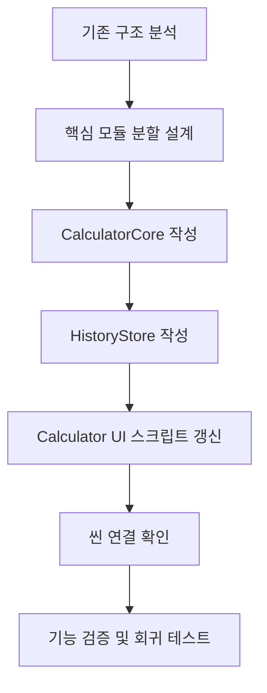

# 구조 리팩터링 진행 흐름도

## 상세 단계
1. **기존 구조 분석**: `Calculator.gd`와 `Calculator.tscn`의 의존 관계, 노드 배치, 입력 처리 흐름을 문서화하고 확장 장애 요인(단일 스크립트 집중)을 확인한다.
2. **핵심 모듈 분할 설계**: 연산 로직, UI 처리, 데이터 저장의 책임을 분리할 클래스를 정의한다.
3. **`CalculatorCore` 작성**: 입력 파싱·검증과 사칙 연산을 담당할 코어 클래스를 구현하고 결과/에러를 사전 구조로 반환하도록 구성한다.
4. **`HistoryStore` 작성**: 최근 계산 기록을 저장하고 용량 제한 및 타임스탬프를 관리하는 저장소 클래스를 구현한다.
5. **UI 스크립트 갱신**: `Calculator.gd`에서 코어/스토어 객체를 생성하고 버튼 신호를 코어로 위임, 성공 시 히스토리 저장까지 처리한다.
6. **씬 연결 확인**: Godot 에디터에서 스크립트 경로를 갱신하고 변수 경고/에러 수정 후 씬을 실행해 연결 상태를 점검한다.
7. **기능 검증 및 회귀 테스트**: 기존 사칙 연산이 정상 동작하는지, 히스토리가 누적되는지 확인하며 자동화 테스트 도입 준비를 한다.
